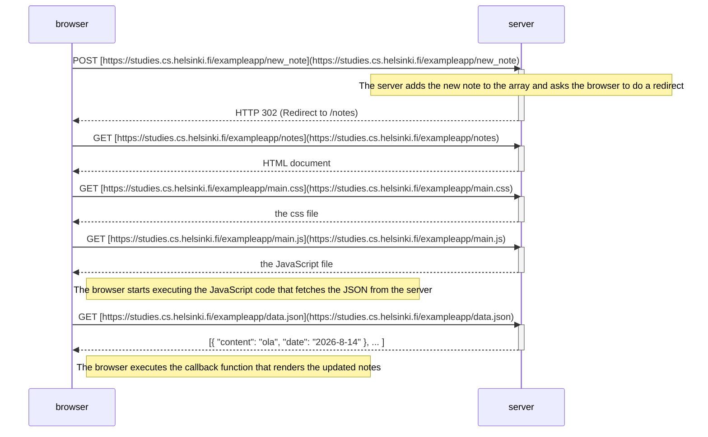

```mermaid
sequenceDiagram
    participant browser
    participant server

    browser->>server: POST [https://studies.cs.helsinki.fi/exampleapp/new_note](https://studies.cs.helsinki.fi/exampleapp/new_note)
    activate server
    Note over server: The server adds the new note to the array and asks the browser to do a redirect
    server-->>browser: HTTP 302 (Redirect to /notes)
    deactivate server

    browser->>server: GET [https://studies.cs.helsinki.fi/exampleapp/notes](https://studies.cs.helsinki.fi/exampleapp/notes)
    activate server
    server-->>browser: HTML document
    deactivate server

    browser->>server: GET [https://studies.cs.helsinki.fi/exampleapp/main.css](https://studies.cs.helsinki.fi/exampleapp/main.css)
    activate server
    server-->>browser: the css file
    deactivate server

    browser->>server: GET [https://studies.cs.helsinki.fi/exampleapp/main.js](https://studies.cs.helsinki.fi/exampleapp/main.js)
    activate server
    server-->>browser: the JavaScript file
    deactivate server

    Note right of browser: The browser starts executing the JavaScript code that fetches the JSON from the server

    browser->>server: GET [https://studies.cs.helsinki.fi/exampleapp/data.json](https://studies.cs.helsinki.fi/exampleapp/data.json)
    activate server
    server-->>browser: [{ "content": "ola", "date": "2026-8-14" }, ... ]
    deactivate server

    Note right of browser: The browser executes the callback function that renders the updated notes
```
