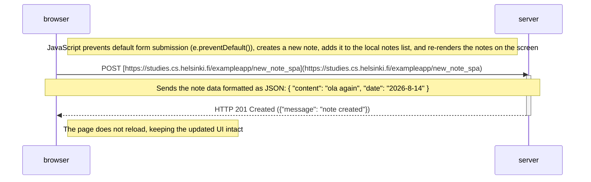

```mermaid
sequenceDiagram
    participant browser
    participant server

    Note right of browser: JavaScript prevents default form submission (e.preventDefault()), creates a new note, adds it to the local notes list, and re-renders the notes on the screen

    browser->>server: POST [https://studies.cs.helsinki.fi/exampleapp/new_note_spa](https://studies.cs.helsinki.fi/exampleapp/new_note_spa)
    activate server
    Note over browser,server: Sends the note data formatted as JSON: { "content": "ola again", "date": "2026-8-14" }
    server-->>browser: HTTP 201 Created ({"message": "note created"})
    deactivate server

    Note right of browser: The page does not reload, keeping the updated UI intact
```
